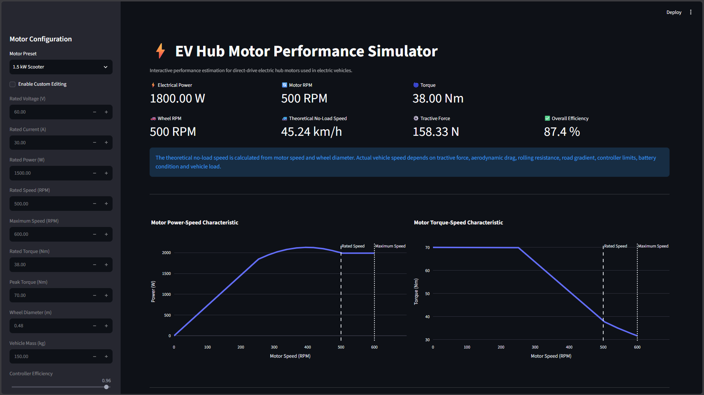
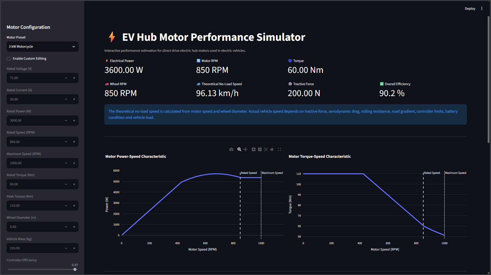
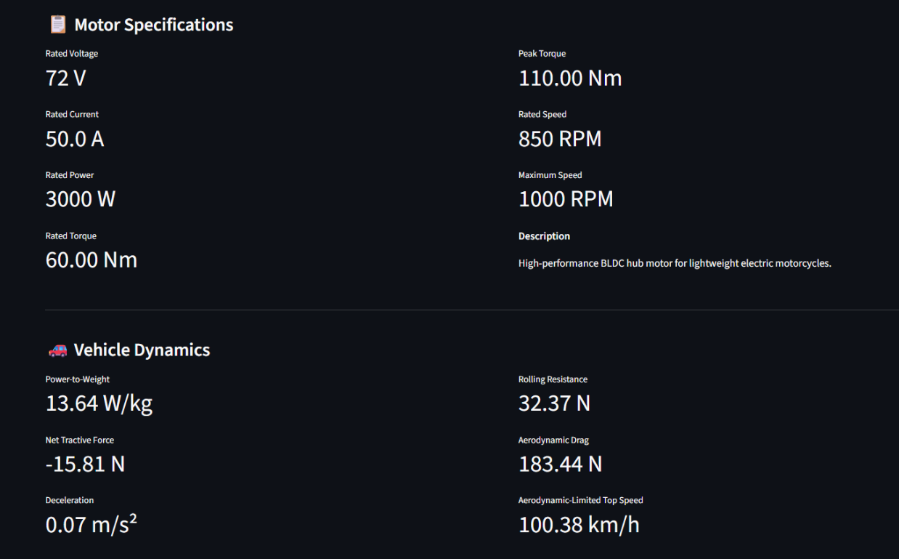
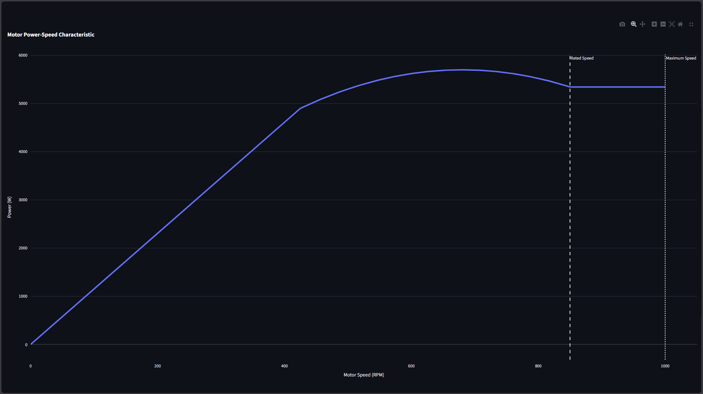
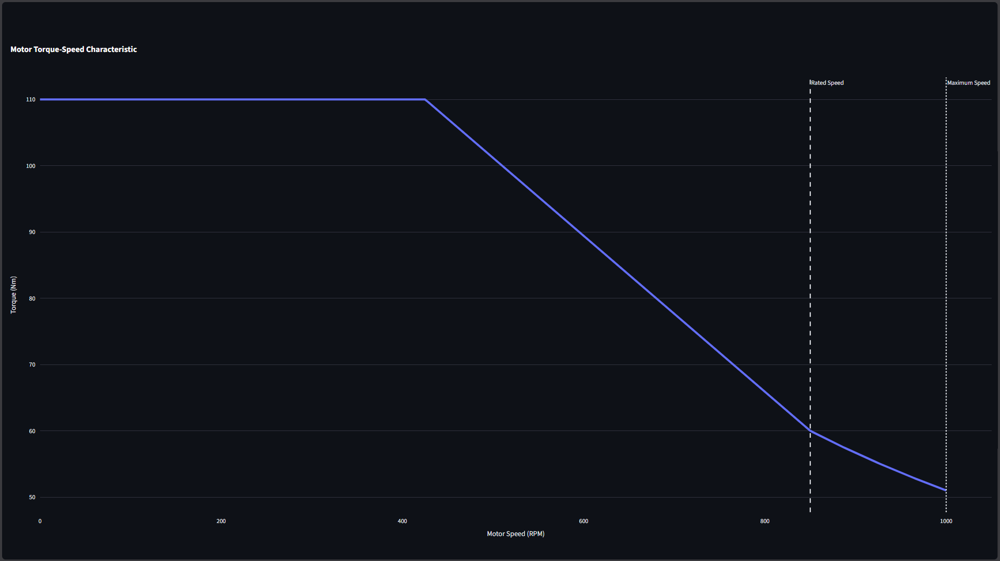

<h1 align="center">⚡ EV Hub Motor Performance Simulator</h1>

<p align="center">
Interactive engineering simulator for analysing the performance of direct-drive BLDC hub motors used in electric vehicles.
</p>

<p align="center">
  
  
  
  
</p>

---

# Overview

The **EV Hub Motor Performance Simulator** is an interactive engineering application that estimates the operating characteristics of direct-drive BLDC hub motors commonly used in electric bicycles, scooters, and lightweight electric motorcycles.

The simulator models motor performance using representative datasheet parameters instead of simplified KV-based calculations, producing more realistic estimates of torque, power, efficiency and vehicle performance.

Designed using **Python**, **Streamlit**, and **Plotly**, the application provides an intuitive dashboard for analysing different hub motor configurations while visualising their characteristic performance curves.

---

# Features

- Interactive engineering dashboard
- Multiple EV hub motor presets
- Custom motor parameter editing
- Datasheet-based motor modelling
- Motor power-speed characteristic
- Motor torque-speed characteristic
- Electrical and mechanical power calculations
- Overall drivetrain efficiency estimation
- Vehicle dynamics analysis
- Tractive force estimation
- Aerodynamic top speed estimation
- Automatic battery configuration based on motor preset
- Responsive Streamlit interface
- Interactive Plotly visualisations

---

# Dashboard Preview

## Main Dashboard

<p align="center">

</p>

---

## High-Power Motorcycle Configuration

<p align="center">

</p>

---

## Engineering Results

<p align="center">

</p>

---

## Performance Curves

| Power-Speed Characteristic | Torque-Speed Characteristic |
|:--------------------------:|:---------------------------:|
|  |  |

---

# Engineering Model

The simulator estimates vehicle performance using representative hub motor specifications, including

- Rated Voltage
- Rated Current
- Rated Power
- Rated Speed
- Maximum Speed
- Rated Torque
- Peak Torque
- Wheel Diameter
- Vehicle Mass
- Controller Efficiency
- Motor Efficiency

The application further estimates

- Electrical Power
- Mechanical Power
- Overall Efficiency
- Wheel Speed
- Theoretical No-Load Speed
- Tractive Force
- Rolling Resistance
- Aerodynamic Drag
- Net Tractive Force
- Aerodynamic-Limited Top Speed
- Power-to-Weight Ratio

---

# Motor Presets

| Preset | Application |
|---------|-------------|
| 250 W E-bike | Urban commuting |
| 750 W E-bike | Performance / Cargo bicycle |
| 1.5 kW Scooter | Urban electric scooter |
| 3 kW Motorcycle | Lightweight electric motorcycle |
| Custom | User-defined configuration |

---

# Installation

Clone the repository

```bash
git clone https://github.com/yourusername/EV-Hub-Motor-Performance-Simulator.git

cd EV-Hub-Motor-Performance-Simulator
```

Install dependencies

```bash
pip install -r requirements.txt
```

Run the application

```bash
streamlit run app.py
```

---

# Usage

1. Select a motor preset.
2. Enable **Custom Editing** if required.
3. Modify motor or vehicle parameters.
4. Observe the updated engineering metrics.
5. Analyse the generated performance curves.

---

# Project Structure

```text
EV-Hub-Motor-Performance-Simulator
│
├── assets/
│   ├── banner.png
│   ├── dashboard.png
│   ├── motorcycle_dashboard.png
│   ├── performance_summary.png
│   ├── power_speed_curve.png
│   └── torque_speed_curve.png
│
├── src/
│   ├── core/
│   ├── data/
│   ├── models/
│   ├── visualization/
│   └── utils/
│
├── app.py
├── requirements.txt
├── README.md
└── LICENSE
